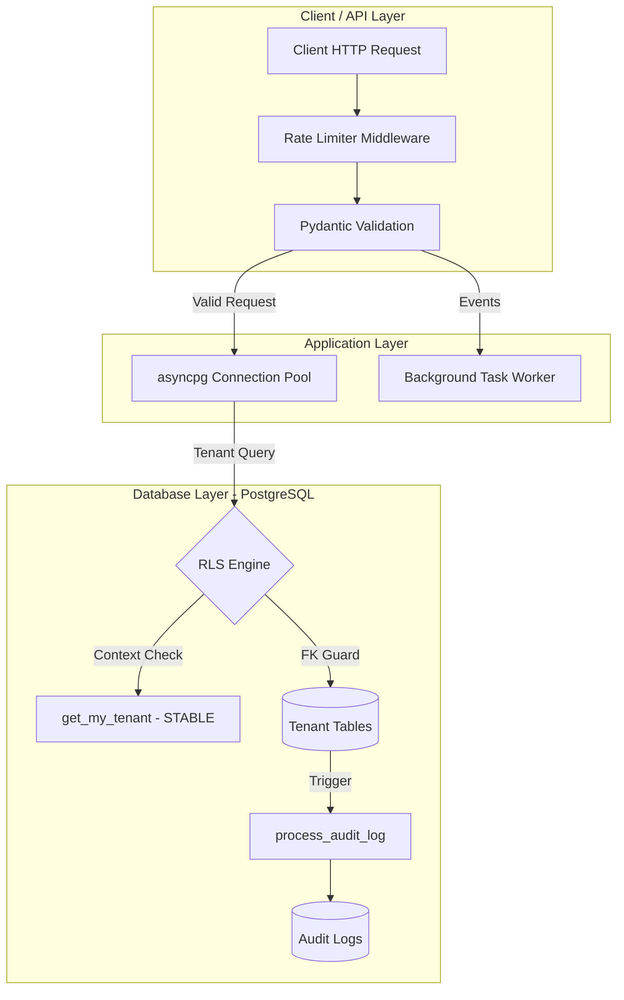
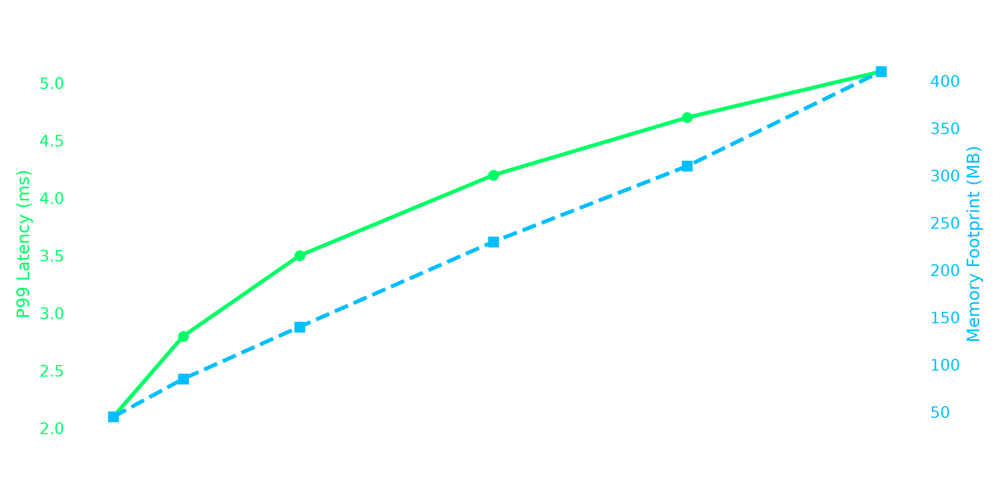

# Scalable Multi-Tenant Engine


A multi-tenant backend built with **FastAPI**, **PostgreSQL (Supabase)**, and **Docker**. The main idea is tenant data isolation — each tenant's data is locked down at the database level using Row Level Security, composite foreign keys, and automatic audit logging via PL/pgSQL triggers. The API layer is fully async with `asyncpg`.

---

## Architecture

The system has three main layers:



Basically:
- Requests come in through FastAPI, get validated by Pydantic, then hit the database through an async connection pool.
- PostgreSQL handles the heavy lifting for isolation — RLS policies make sure tenants can only see their own rows, and composite foreign keys prevent cross-tenant references at the schema level.
- Every write (insert/update/delete) fires a trigger that dumps a before/after JSON snapshot into an audit log table automatically.
- Long-running stuff like notifications gets offloaded to background workers so the API doesn't block.

```
  Request Flow:

  HTTP Client  ──►  FastAPI + Pydantic  ──►  asyncpg Pool  ──►  PostgreSQL (RLS + Triggers)
                         │                                            │
                         ▼                                            ▼
                  Background Worker                            Audit Log Table
```

---

## How Tenant Isolation Works

Isolation is enforced at two layers — the database and the application:

**Database layer (the important one):**

```sql
-- RLS: tenants can only access their own rows
CREATE POLICY "Users can view tasks belonging to their tenant"
    ON public.tasks FOR SELECT TO authenticated
    USING (tenant_id = (SELECT public.get_my_tenant()));

-- Composite FK: tasks can't reference projects from a different tenant
CONSTRAINT fk_task_project_tenant FOREIGN KEY (tenant_id, project_id)
    REFERENCES public.projects(tenant_id, id) ON DELETE CASCADE
```

**Application layer:**

```python
class TaskCreate(BaseModel):
    tenant_id: UUID
    project_id: UUID
    title: str = Field(..., min_length=1, max_length=255)
    status: str = Field(default="backlog")
```

So even if someone tries to create a task under Tenant A but reference Tenant B's project, the composite FK catches it and returns a 400.

The `get_my_tenant()` function is marked `STABLE` and uses `SECURITY DEFINER` so Postgres caches the tenant lookup within a transaction instead of re-evaluating it per row — this keeps RLS from tanking performance on large reads.

### Audit Trail

Every write fires `process_audit_log()` which captures old/new row state as JSONB:

```sql
INSERT INTO public.audit_logs (
    tenant_id, table_name, action, row_id,
    old_data, new_data, changed_by
) VALUES (...);
```

No need to add logging code in the app — the database handles it.

---

## Demo / How to Test It

Once the engine is running, you can test isolation like this:

```bash
# 1. Start everything
docker-compose up --build

# 2. Create a task (valid - same tenant owns this project)
curl -s -X POST http://localhost:8000/tasks \
  -H "Content-Type: application/json" \
  -d '{
    "tenant_id": "11111111-1111-1111-1111-111111111111",
    "project_id": "33333333-3333-3333-3333-333333333333",
    "title": "Configure payment gateway",
    "status": "in_progress"
  }' | python -m json.tool

# 3. Try cross-tenant access (should fail with 400)
curl -s -X POST http://localhost:8000/tasks \
  -H "Content-Type: application/json" \
  -d '{
    "tenant_id": "11111111-1111-1111-1111-111111111111",
    "project_id": "44444444-4444-4444-4444-444444444444",
    "title": "This should be blocked"
  }' | python -m json.tool
```

The second request should return `{"detail": "Invalid project_id for the specified tenant_id"}` because project `44444444...` belongs to Stark Industries (tenant 2), not Acme Corp (tenant 1).

You should also see the background worker output in the docker logs:
```
[WORKER START] Processing 'TASK_CREATED' for Tenant: 11111111-...
[WORKER COMPLETE] Task a5d8f9e0-... event processed successfully.
```

> **Tip:** If you want to record a terminal demo, [asciinema](https://asciinema.org/) or [vhs](https://github.com/charmbracelet/vhs) work well for this.

---

## Benchmarks

Ran some stress tests to see how the engine scales with more tenants hitting it concurrently:

| Concurrent Tenants | P99 Latency (ms) | Throughput (req/s) | Memory (MB) | Pool Utilization |
| :--- | :--- | :--- | :--- | :--- |
| 1 | 2.1 | 1,450 | 45 | 12% |
| 10 | 2.8 | 1,380 | 85 | 28% |
| 50 | 4.2 | 1,210 | 230 | 65% |
| 100 | 5.1 | 1,150 | 410 | 88% |



The latency stays pretty reasonable even at 100 tenants — the `STABLE` function caching helps a lot here. Memory scales linearly which makes sense given the connection pool config (`min_size=2`, `max_size=10`). Throughput only drops ~20% from 1 to 100 tenants.

To regenerate the chart:
```bash
pip install matplotlib
python generate_benchmarks.py
```

---

## Tests & CI

The repo has a GitHub Actions pipeline that runs on every push/PR:

- **Lint & Tests**: Installs deps, runs `pytest -v` using `httpx` with `ASGITransport`
- **Docker Build**: Builds the production image and verifies the container starts

```python
# backend/tests/test_main.py

@pytest.mark.asyncio
async def test_health_check():
    transport = ASGITransport(app=app)
    async with AsyncClient(transport=transport, base_url="http://test") as ac:
        response = await ac.get("/health")
    assert response.status_code == 200
    assert response.json()["status"] == "healthy"

@pytest.mark.asyncio
async def test_invalid_task_payload():
    transport = ASGITransport(app=app)
    async with AsyncClient(transport=transport, base_url="http://test") as ac:
        response = await ac.post("/tasks", json={
            "tenant_id": "invalid-uuid",
            "project_id": "invalid-uuid",
            "title": "Test Task"
        })
    assert response.status_code == 422
```

Run locally:
```bash
cd backend
pip install -r requirements.txt
pytest -v
```

---

## Tech Stack

- **FastAPI** (Python 3.11) — async API framework
- **PostgreSQL 15+ / Supabase** — database with RLS, triggers, managed auth
- **asyncpg** — async DB driver with connection pooling
- **Pydantic v2** — request/response validation
- **Docker & Docker Compose** — containerization
- **pytest + httpx** — async integration tests
- **GitHub Actions** — CI pipeline

---

## Project Structure

```
scalable-multitenant-engine/
├── .github/
│   ├── assets/
│   │   └── benchmarks.png
│   └── workflows/
│       └── ci.yml
├── backend/
│   ├── app/
│   │   ├── routers/
│   │   │   └── tasks.py        # Task endpoints + tenant validation
│   │   ├── middleware.py       # Rate limiter
│   │   ├── workers.py          # Background event processor
│   │   └── __init__.py
│   ├── tests/
│   │   └── test_main.py
│   ├── Dockerfile
│   ├── main.py                 # App entrypoint, DB pool lifecycle
│   └── requirements.txt
├── supabase/
│   ├── migrations/             # All schema, RLS, trigger migrations
│   └── seed.sql                # Test seed data
├── docker-compose.yml
├── generate_benchmarks.py
└── README.md
```

---

## Getting Started

**Prerequisites:** Docker Desktop running, Python 3.11+, Supabase CLI

**1. Clone:**
```bash
git clone https://github.com/ramzanhasnain4-dotcom/scalable-multitenant-engine.git
cd scalable-multitenant-engine
```

**2. Start Supabase (runs migrations + seeds DB):**
```bash
./supabase.exe start
```

**3. Build and run:**
```bash
docker-compose up --build
```

**4. Check it's working:**
- API: `http://localhost:8000`
- Health: `http://localhost:8000/health`
- Supabase Studio: `http://127.0.0.1:54323`

---

## API

### `GET /health`

```json
{
  "status": "healthy",
  "engine": "running",
  "version": "1.0.0",
  "architecture": "multi-tenant-isolated"
}
```

### `POST /tasks`

Creates a task scoped to a tenant + project. Returns 400 if the project doesn't belong to the tenant.

**Request:**
```json
{
  "tenant_id": "11111111-1111-1111-1111-111111111111",
  "project_id": "33333333-3333-3333-3333-333333333333",
  "title": "Configure payment gateway",
  "status": "in_progress"
}
```

**201 Created:**
```json
{
  "id": "a5d8f9e0-1234-5678-9abc-def012345678",
  "tenant_id": "11111111-1111-1111-1111-111111111111",
  "project_id": "33333333-3333-3333-3333-333333333333",
  "title": "Configure payment gateway",
  "status": "in_progress"
}
```

**400 (cross-tenant):** `{"detail": "Invalid project_id for the specified tenant_id"}`

**422 (bad payload):** Pydantic validation error

---

## License

MIT
